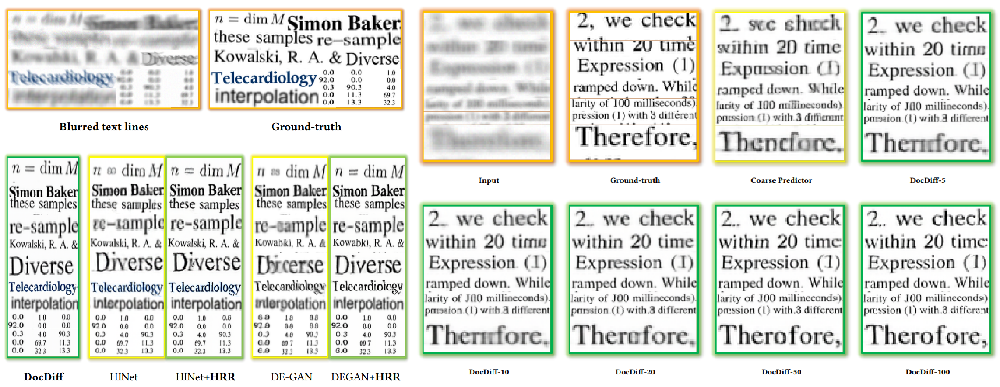

 

[简体中文](README.md) | [English](README.EN.md)
# DocDiff
This is an official implementation for the paper DocDiff: Document Enhancement via Residual Diffusion Models.
Not only document enhancement, DocDiff can also be used directly on other img2img tasks, including natural scene deblurring [1](#refer-anchor-1), denosing, inpainting, super resolution [2](#refer-anchor-2).

# The translation is not finished yet! Just wait a minute, please!

# References

- [1] Whang J, Delbracio M, Talebi H, et al. Deblurring via stochastic refinement[C]//Proceedings of the IEEE/CVF Conference on Computer Vision and Pattern Recognition. 2022: 16293-16303.

- [2] Shang S, Shan Z, Liu G, et al. ResDiff: Combining CNN and Diffusion Model for Image Super-Resolution[J]. arXiv preprint arXiv:2303.08714, 2023.
